# Electronic Trip Assisstant 

Main: Showing the current trip information, participants' information, including location information from remote server.

If no trip:

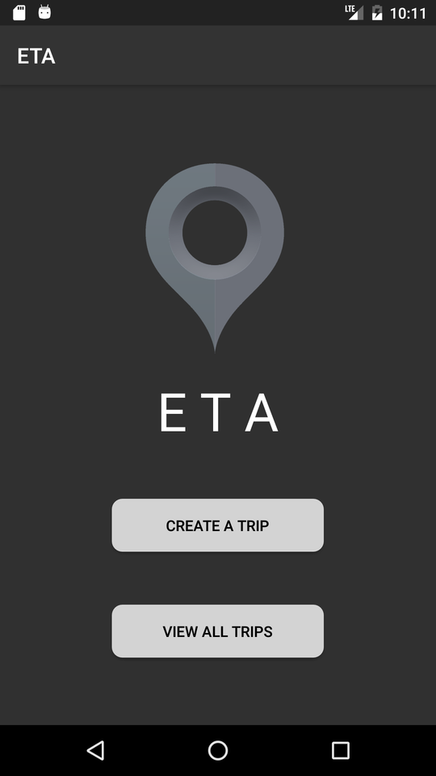

If there is a current trip:

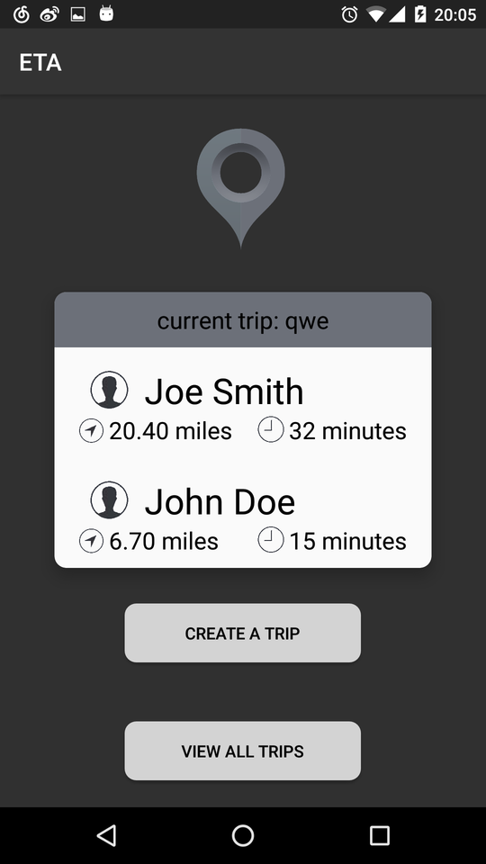

Create a trip:

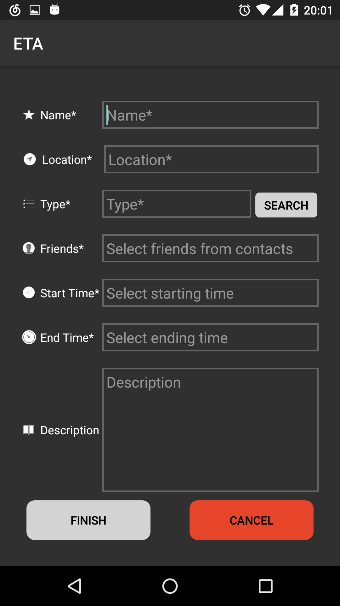

Select contact people:

Select date and time:

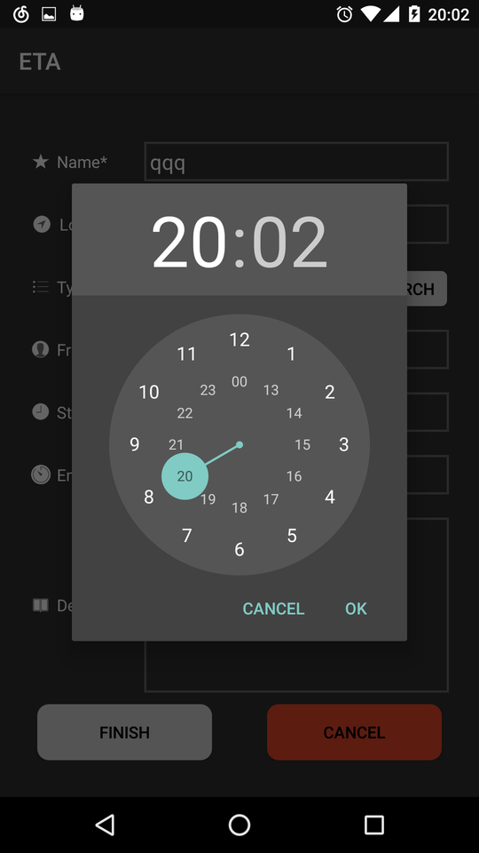

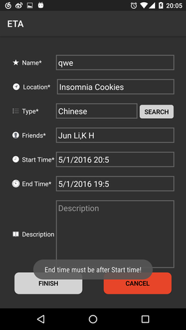

Finish filling:

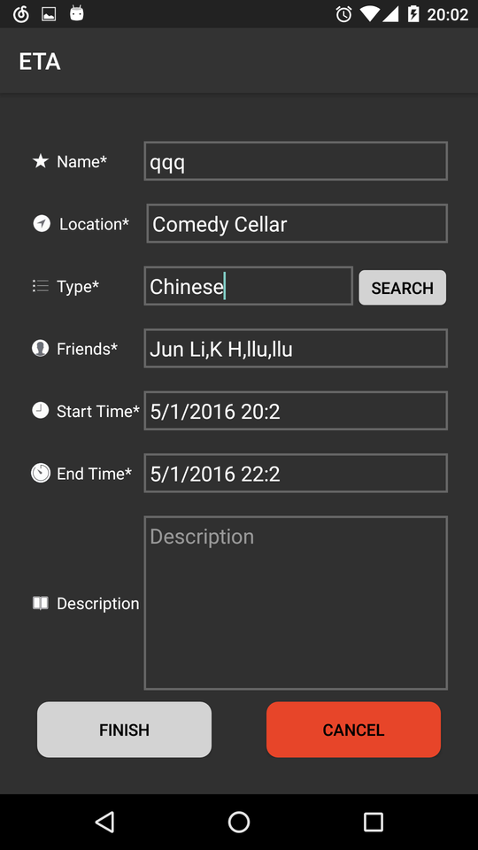

Check all trips:(from Main)

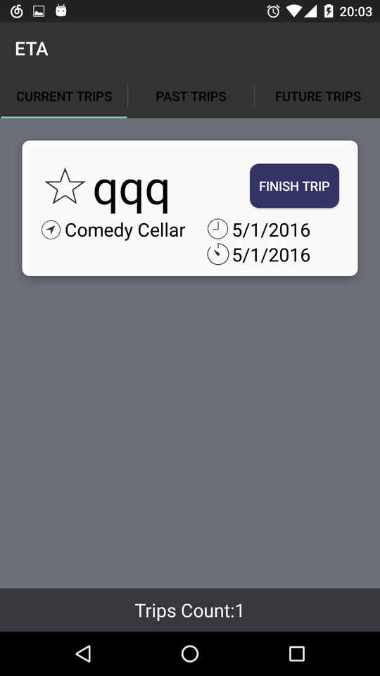

If no trip:

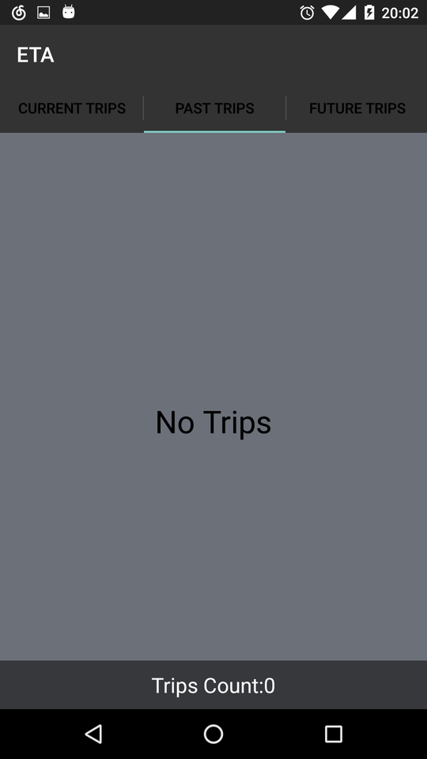

Else:

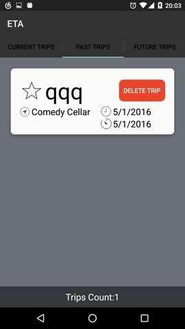

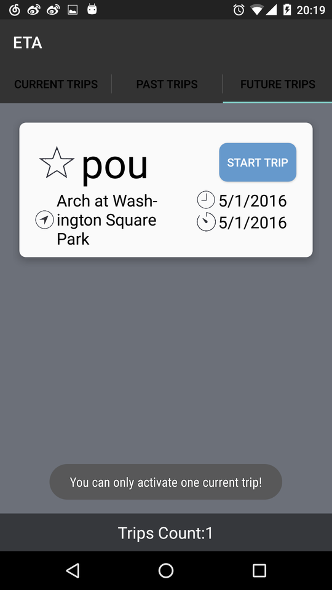

View trip details:

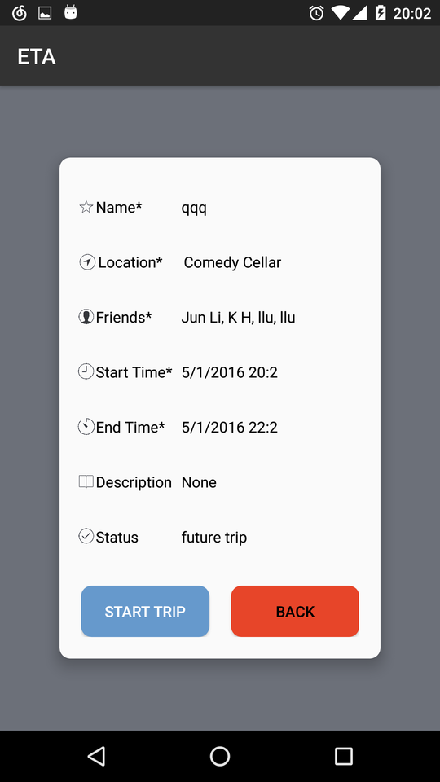

Since the remote server that some necessary services rely on has been shut down, this app might not work as normal.